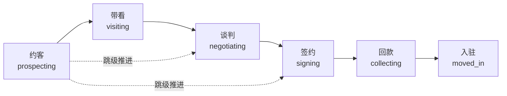

# 产业地产 CRM SaaS 系统 - 产品需求说明书

**版本：** 1.3  
**编制日期：** 2026-04-14  
**最后修改日期：** 2026-04-24  
**产品定位：** 面向产业地产中介机构的 SaaS 化客户关系管理工具

## 修订记录

| 版本 | 日期 | 修改说明 |
|------|------|---------|
| 1.3 | 2026-04-24 | 明确 SaaS 用户主体、认证方式、租户成员、部门归属模型；补充激活、待绑定手机号、成员管理边界与多部门归属规则 |
| 1.2 | 2026-04-21 | 调整项目阶段更新交互：在“更新阶段”弹窗中，选择签约/回款时直接内嵌合同新建/回款登记表单并提交后自动推进阶段 |
| 1.1 | 2026-04-17 | 合并并清理冲突需求口径，统一 V1 基线（角色权限、负责人、合同回款、软删除、成员状态） |
| 1.0 | 2026-04-14 | 初版需求文档 |

---

## 一、产品概述

### 1.1 产品背景

产业地产中介机构在日常业务中面临以下痛点：

- **客户信息分散**：联系人信息散落在个人手机、微信、笔记本等渠道，难以统一管理和共享
- **项目跟进混乱**：销售过程缺乏系统化记录，团队协作时信息传递不畅，容易遗漏关键节点
- **合同回款追踪困难**：签约后的回款节点管理依赖人工记忆，易出现逾期遗漏
- **团队管理效率低**：管理者难以实时掌握团队销售动态，无法有效评估业绩和分配资源

### 1.2 产品目标

本系统旨在为产业地产中介机构提供一站式客户关系管理解决方案，实现以下目标：

1. **统一客户管理**：建立标准化联系人档案，支持多维度信息记录（姓名、企业、职位、联系方式、决策人标记等）
2. **规范项目流程**：固化"约客→带看→谈判→签约→回款→入驻"的标准销售流程，每个阶段自动记录关键时间节点
3. **强化过程追踪**：支持跟进记录、合同管理、回款节点的全流程数字化管理
4. **提升团队协作**：基于组织层级实现数据权限分级，上级可操作下属项目，项目管理员可查看全局
5. **降低管理成本**：自动化 ID 生成、数据字典配置、权限继承，减少人工维护工作量

### 1.3 目标用户

本系统的目标用户群体主要分为两大类：**一线招商人员**与**管理层**。

| 用户群体 | 典型特征 | 核心诉求 |
|---------|---------|---------|
| **一线招商人员** | 日常负责客户拓展、项目跟进、带看谈判等具体业务执行 | 快速录入客户信息、便捷记录跟进过程、实时查看自己的项目进展、高效处理工作交接 |
| **管理层** | 包含销售经理、项目管理员及系统管理员，负责团队管理、资源分配及系统配置 | 全局掌握团队动态、评估业绩表现、监控业务流程、灵活配置权限与数据字典、处理离职交接 |

---

## 二、核心功能模块

### 2.1 功能架构总览

系统包含五大核心功能模块：

```
┌─────────────────────────────────────────────────────────────┐
│                    产业地产 CRM SaaS 系统                      │
├─────────────────────────────────────────────────────────────┤
│  ┌──────────────┐  ┌──────────────┐  ┌──────────────┐        │
│  │  联系人管理   │  │  项目管理     │  │  跟进记录     │        │
│  │  - 新增联系人 │  │  - 创建项目   │  │  - 添加跟进   │        │
│  │  - 编辑信息   │  │  - 阶段推进   │  │  - 查看历史   │        │
│  │  - 查询检索   │  │  - 项目详情   │  │  - 方式标记   │        │
│  └──────────────┘  └──────────────┘  └──────────────┘        │
│                                                              │
│  ┌──────────────┐  ┌──────────────┐  ┌──────────────┐        │
│  │  合同管理     │  │  回款管理     │  │  系统设置     │        │
│  │  - 签约登记   │  │  - 实收登记   │  │  - 权限配置   │        │
│  │  - 合同详情   │  │  - 实收记录   │  │  - 数据字典   │        │
│  │  - 附件上传   │  │  - 发票状态   │  │  - 成员管理   │        │
│  └──────────────┘  └──────────────┘  └──────────────┘        │
└─────────────────────────────────────────────────────────────┘
```

---

### 2.2 联系人管理模块

#### 功能概述

联系人管理是 CRM 系统的基础模块，用于建立和维护客户档案。每个联系人可关联多个项目，支持完整的信息记录和快速检索。

#### 核心功能点

| 功能项 | 功能描述 | 业务价值 |
|-------|---------|---------|
| **新增联系人** | 录入客户基本信息：姓名、企业名称、职位、手机号（必填）、微信号、邮箱、办公电话、是否决策人、备注等 | 建立标准化客户档案，避免信息遗漏 |
| **编辑联系人** | 修改联系人信息，支持字段级更新 | 保持客户信息的时效性和准确性 |
| **查询检索** | 支持按姓名、企业名称、手机号快速搜索 | 提升信息查找效率，减少重复录入 |
| **关联项目** | 联系人可关联多个销售项目，在项目详情页显示联系人信息 | 实现客户与业务的联动，便于追溯历史 |

#### 数据字段规范

| 字段名称 | 是否必填 | 说明 |
|---------|---------|------|
| 姓名 | 必填 | 联系人姓名 |
| 手机号 1 | 必填 | 主要联系方式，组织内不可重复 |
| 企业名称 | 选填 | 所属企业名称 |
| 职位 | 选填 | 职务头衔 |
| 是否决策人 | 选填 | 标记关键决策人，便于优先跟进 |
| 手机号 2 | 选填 | 备用联系方式 |
| 微信号 | 选填 | 社交联系方式 |
| 邮箱 | 选填 | 电子邮箱 |
| 办公电话 | 选填 | 公司座机 |
| 性别 | 选填 | 男/女/未知 |
| 备注 | 选填 | 自由文本备注 |
| 创建人 | 系统自动 | 记录首次创建该联系人的用户 |
| 负责人 | 系统自动 | 记录当前负责维护该联系人的用户（默认为创建人，可转移） |
| 最后编辑时间 | 系统自动 | 记录最近一次编辑该联系人的时间，用于判断信息新鲜度 |

#### 业务规则

1. **唯一性约束**：同一组织内，手机号 1 与手机号 2 均不可重复（空值允许重复）；且同一联系人的手机号 1 不能等于手机号 2
2. **自动 ID 生成**：系统自动生成联系人编号（格式：日期 + 序号），无需人工编号
3. **创建人与负责人**：
   - 创建人：记录首次创建该联系人的用户，不可修改，用于责任追溯
   - 负责人：记录当前负责维护该联系人的用户，默认为创建人，支持手动转移
   - 编辑权限校验基于负责人而非创建人：只有负责人或项目管理员可编辑联系人信息
   - 每次编辑成功后，系统自动刷新“最后编辑时间”
4. **删除约束**：已被项目关联的联系人不可删除
5. **跨组织隔离**：不同中介机构的联系人数据完全隔离，互不可见

---

### 2.3 项目管理模块

#### 功能概述

项目管理是系统的核心模块，贯穿销售全流程。每个项目关联一个联系人，记录从初步接触到最终入驻的完整过程。

#### 项目阶段流转（核心业务流程）

项目阶段按固定顺序流转，反映产业地产销售的标准流程：

```
约客 → 带看 → 谈判 → 签约 → 回款 → 入驻
```

| 阶段 | 定义 | 关键时间节点 | 业务动作 |
|------|------|------------|---------|
| **约客** | 初步接触客户，了解需求 | 首次建联时间（必填） | 录入联系人、创建项目、标记项目级别和来源 |
| **带看** | 带领客户实地考察项目 | 首次带看日期（必填） | 记录带看过程、更新项目阶段 |
| **谈判** | 商务条款洽谈 | 首次谈判日期（必填） | 记录谈判要点、跟进关键决策人反馈 |
| **签约** | 签订合同 | - | 在“更新阶段”弹窗内直接新建合同，提交成功后自动进入签约 |
| **回款** | 按合同节点收款 | - | 在“更新阶段”弹窗内直接登记回款，提交成功后自动进入回款 |
| **入驻** | 客户正式入驻办公 | 入驻日期（必填） | 标记项目完成、归档项目资料 |

#### 阶段流转规则

- ✅ **顺序推进**：按标准流程逐阶段推进（约客→带看→谈判→签约→回款→入驻）
- ⚠️ **跳级推进**：允许跳过中间阶段（如约客直接到签约），但需在备注中说明原因
- ❌ **禁止回退**：阶段不可逆向回退（如谈判不可回到约客），特殊情况需联系项目管理员处理
- 📌 **自动记录**：阶段变更时系统自动记录变更时间和操作人

**更新阶段弹窗交互规则（V1.2）**：

1. 选择目标阶段为“约客/带看/谈判/入驻”时，弹窗展示对应阶段字段并执行阶段更新。
2. 选择目标阶段为“签约”时，弹窗内展示“合同新建表单”（合同编号、合同标题、合同金额、签约日期），提交成功后系统自动将项目阶段更新为“签约”。
3. 选择目标阶段为“回款”时，弹窗内展示“回款登记表单”（关联合同、回款日期、回款金额、开票状态），提交成功后系统自动将项目阶段更新为“回款”。
4. “签约/回款”阶段不再通过手填阶段日期推进，统一通过业务单据（合同/回款）驱动，避免阶段字段与业务单据双写冲突。

#### 项目信息字段

| 字段名称 | 是否必填 | 说明 |
|---------|---------|------|
| 项目名称 | 必填 | 项目标识名称 |
| 关联联系人 | 必填 | 选择已有联系人 |
| 项目阶段 | 必填 | 当前所处阶段（约客/带看/谈判/签约/回款/入驻） |
| 租购类型 | 必填 | 租赁/购买/可租可买 |
| 负责人 | 必填 | 指定销售人员（默认为创建人） |
| 项目级别 | 选填 | 重点/一般/VIP 等（可在系统设置中自定义） |
| 项目来源 | 选填 | 陌生拜访/客户推荐/市场活动等（可在系统设置中自定义） |
| 意向面积 | 选填 | 客户意向租赁/购买面积（㎡） |
| 首次建联时间 | 约客阶段必填 | 初次接触客户的时间 |
| 首次带看日期 | 带看阶段必填 | 第一次实地带看的时间 |
| 首次谈判日期 | 谈判阶段必填 | 第一次商务谈判的时间 |
| 入驻日期 | 入驻阶段必填 | 客户正式入驻的时间 |
| 创建人 | 系统自动 | 记录首次创建该项目的用户 |

#### 业务规则

1. **自动编号**：系统自动生成项目编号（格式：日期 + 序号），便于检索和归档
2. **阶段必填字段**：推进到特定阶段时，对应时间节点字段变为必填
3. **创建人与负责人**：
   - 创建人：记录首次创建该项目的用户，不可修改，用于责任追溯
   - 负责人：记录当前负责维护该项目的用户，默认为创建人，支持手动转移
   - 编辑权限校验基于负责人而非创建人：只有负责人或项目管理员可编辑项目信息
4. **负责人锁定**：负责人始终可见该项目，不受项目数据范围配置限制
5. **软删除联动**：项目删除采用软删除，并联动软删除该项目下的跟进记录、合同、回款记录
6. **跨组织隔离**：不同机构的项目数据完全隔离，互不可见

---

### 2.4 跟进记录模块

#### 功能概述

跟进记录用于详细记录销售过程中的每一次沟通，是项目过程管理的重要支撑。

#### 核心功能点

| 功能项 | 功能描述 | 业务价值 |
|-------|---------|---------|
| **添加跟进** | 录入跟进内容、跟进方式、跟进时间，关联项目和联系人 | 详细记录沟通过程，便于复盘和交接 |
| **跟进方式标记** | 支持标记跟进渠道：电话/微信/面谈/邮件/其他 | 分析不同渠道的转化效果 |
| **历史查看** | 查看项目的完整跟进历史，按时间倒序排列 | 快速了解项目进展脉络 |
| **关联联系人** | 可标记本次跟进涉及的联系人（如与决策人面谈） | 精准定位关键沟通对象 |

#### 跟进记录字段

| 字段名称 | 是否必填 | 说明 |
|---------|---------|------|
| 关联项目 | 必填 | 选择要跟进的项目 |
| 跟进内容 | 必填 | 详细记录沟通要点、客户反馈、下一步计划 |
| 跟进时间 | 必填 | 发生时间（默认当前时间，可回填历史时间） |
| 跟进方式 | 选填 | 电话/微信/面谈/邮件/其他 |
| 关联联系人 | 选填 | 本次沟通涉及的联系人 |

#### 业务规则

1. **自动编号**：系统自动生成跟进记录编号（格式：日期 + 序号）
2. **创建人与负责人**：
   - 创建人：记录首次创建该跟进记录的用户，不可修改
   - 负责人：默认为创建人，支持手动转移
   - 编辑权限校验基于负责人：只有负责人或项目管理员可编辑跟进记录
3. **时间可回填**：支持录入历史跟进记录，时间字段可手动调整
4. **项目阶段联动**：关键跟进可触发项目阶段推进（如首次带看跟进自动记录带看日期）

---

### 2.5 合同管理模块

#### 功能概述

合同管理用于记录签约信息，是项目从谈判阶段进入签约阶段的标志。

#### 核心功能点

| 功能项 | 功能描述 | 业务价值 |
|-------|---------|---------|
| **签约登记** | 录入合同编号、标题、金额、签约日期、期限等 | 建立合同档案，便于后续回款管理 |
| **佣金预估** | 记录预估佣金金额 | 评估项目收益，支持业绩预测 |
| **附件上传** | 上传合同扫描件或电子版 | 实现合同电子化归档，便于随时查阅 |
| **关联项目** | 合同必须关联已有项目 | 实现合同与项目的联动，避免信息孤岛 |

#### 合同信息字段

| 字段名称 | 是否必填 | 说明 |
|---------|---------|------|
| 合同编号 | 必填 | **用户手动输入**（支持字母 + 数字组合），组织内不可重复 |
| 合同标题 | 必填 | 合同标识名称 |
| 关联项目 | 必填 | 选择已创建且未删除的项目（V1：每个项目仅允许一个合同） |
| 合同金额 | 必填 | 合同总金额 |
| 签约日期 | 必填 | 合同签订时间 |
| 预估佣金 | 选填 | 预计佣金收益 |
| 起租日期 | 选填 | 租赁起始时间 |
| 到期日期 | 选填 | 租赁到期时间 |
| 期限（月） | 选填 | 租赁期限 |
| 付款方式 | 选填 | 付款条款说明 |
| 合同附件 | 必填 | 上传合同文件 |

#### 业务规则

1. **手动编号**：合同编号由用户手动输入（区别于其他模块的自动编号），便于对接外部合同管理系统
2. **唯一性约束**：同一组织内，合同编号不可重复
3. **创建人与负责人**：
   - 创建人：记录首次创建该合同的用户，不可修改
   - 负责人：默认为创建人，支持手动转移
   - 编辑权限校验基于负责人：只有负责人或项目管理员可编辑合同信息
4. **项目阶段联动**：创建合同后，项目自动推进到"签约"阶段
5. **附件必填**：合同附件为必填项，实现合同电子化存档
6. **项目合同唯一性（V1）**：每个项目仅允许创建一份合同

---

### 2.6 回款管理模块

#### 功能概述

回款管理用于追踪合同回款节点，是项目从签约阶段进入回款阶段的标志。

#### 核心功能点

| 功能项 | 功能描述 | 业务价值 |
|-------|---------|---------|
| **实收记录** | 录入实际回款日期、实收金额 | 追踪回款进度，确认项目收益 |
| **发票状态** | 标记发票开具状态：已开票/未开票/不需开票 | 管理开票进度，避免税务风险 |
| **回款凭证** | 上传银行回单、转账凭证等附件 | 实现回款凭证电子化归档 |

#### 回款记录字段

| 字段名称 | 是否必填 | 说明 |
|---------|---------|------|
| 关联合同 | 必填 | 选择要记录回款的合同 |
| 实际回款日期 | 必填 | 实际收款时间 |
| 实收金额 | 必填 | 实际收款金额 |
| 付款方名称 | 选填 | 付款单位或个人名称 |
| 发票状态 | 选填 | 已开票/未开票/不需开票 |
| 回款凭证 | 选填 | 上传回款凭证文件 |
| 备注 | 选填 | 其他说明 |

#### 业务规则

1. **自动编号**：系统自动生成回款记录编号（格式：日期 + 序号）
2. **多节点支持**：一个合同可创建多条回款记录，支持分期收款场景
3. **创建人与负责人**：
   - 创建人：记录首次创建该回款记录的用户，不可修改
   - 负责人：默认为创建人，支持手动转移
   - 编辑权限校验基于负责人：只有负责人或项目管理员可编辑回款信息
4. **登记人记录**：系统自动记录回款登记人

---

### 2.7 系统设置模块

#### 功能概述

系统设置用于组织级配置管理，由具备系统设置菜单权限的角色访问（V1 默认由系统管理员拥有该权限）。

#### 核心功能点

| 功能项 | 功能描述 | 业务价值 |
|-------|---------|---------|
| **权限配置** | 设置项目数据范围配置、指定项目管理员 | 适配不同组织的管理风格 |
| **数据字典** | 自定义项目级别、项目来源的显示名称 | 适配组织内部术语习惯 |
| **成员管理** | 查看组织成员列表、维护成员状态（启用/停用）与所属角色 | 了解团队成员、处理账号启停与角色管理 |

#### 权限配置项

**项目数据范围配置**（具备权限配置菜单权限的角色可配置，V1 默认系统管理员）：

| 模式 | 名称 | 说明 | 适用场景 |
|------|------|------|----------|
| **仅自己** | 成员仅可操作自己负责人范围内的数据 | 高隔离、强隐私场景（如个人业绩考核） |
| **看下属（默认）** | 上级可操作全部下属（直接+间接）负责的数据 | 标准销售团队管理（团队协作场景） |

**项目管理员指定**（具备权限配置菜单权限的角色可配置，V1 默认系统管理员）：

- 可指定多名项目管理员
- 项目管理员可查看本组织所有项目，不受项目数据范围配置限制
- 适用于销售总监、运营经理等全局管理角色

#### 成员管理边界（V1）

1. 成员列表字段包含：租户内姓名、主手机号/待绑定手机号、员工编号、主部门、所属角色、激活状态、成员状态
2. “项目数据范围配置”是独立配置，不在成员列表中展示或编辑
3. 项目负责人转移属于业务数据操作（在项目相关模块执行），不在成员列表中执行
4. 业务数据操作日志属于业务模块能力，不归属成员列表页面
5. 已激活成员的正式手机号不可由租户管理员修改；未激活成员仅允许修改待绑定手机号

#### SaaS 用户与成员模型（V1）

系统将“用户是谁”“用户如何登录”“用户是否属于某个租户”“用户在租户下属于哪些部门”拆分建模。

| 对象 | 中文名 | 作用 | 关键字段 |
|------|--------|------|---------|
| `users` | 用户表 | 平台级用户主体，保存主手机号、平台级姓名与最近登录租户 | `user_id`、`phone`、`name`、`last_tenant_id` |
| `user_authentications` | 用户认证方式表 | 保存手机号登录、后续钉钉登录等认证绑定关系 | `auth_type`、`auth_identifier`、`password_hash` |
| `tenant_users` | 租户用户表 | 保存用户在当前租户下的成员档案、激活状态、成员状态 | `tenant_id`、`user_id`、`pending_phone`、`activated`、`status` |
| `organization_memberships` | 组织成员关系表 | 保存成员在当前租户下的主部门与兼职部门归属 | `tenant_user_id`、`department_id`、`role_id`、`is_primary` |

模型规则：

1. `users.phone` 为用户正式主手机号，全局唯一，由用户本人维护
2. `users.last_tenant_id` 记录用户最近一次成功进入的租户，用于多租户场景下的默认进入
3. `tenant_users.pending_phone` 仅用于未激活成员，表示待绑定手机号，不是正式登录手机号
4. `tenant_users.activated` 表示该成员是否至少成功登录过一次当前租户平台，按租户维度独立计算
5. `users.name` 与 `tenant_users.name` 为两个独立字段，不强同步
6. 一个用户可有多条 `user_authentications` 记录，用于支持手机号、钉钉等多种认证方式
7. 一个租户成员可有多条 `organization_memberships` 记录，用于支持一人多部门

#### 成员字段与行为规则（V1）

成员管理页当前需满足以下规则：

1. `employee_no` 在租户内唯一，可为空
2. 当前组织模型按部门树处理，部门归属先以 `department_id` 为准
3. `position` 先采用自由文本
4. `role_id` 先按单值处理
5. 部门归属删除时不物理删除，改 `status` 并记录 `left_at`
6. 当前租户页面展示姓名时，优先读取 `tenant_users.name`；全局导出或兜底场景读取 `users.name`

#### 数据字典配置

组织可自定义以下枚举值的显示名称：

| 字典类型 | 默认值 | 可自定义内容 |
|---------|-------|------------|
| **项目级别** | 重点、一般 | 可添加/修改/禁用级别类型，自定义显示名称 |
| **项目来源** | 陌生拜访、客户推荐、市场活动、其他 | 可添加/修改/禁用来源类型，自定义显示名称 |

**配置规则**：

1. **组织隔离**：每个组织的字典配置独立，跨组织不可见
2. **历史一致性**：修改显示名称后，历史项目的显示名称自动更新
3. **启用/禁用**：可禁用不再使用的字典项，已使用的历史数据不受影响

---

## 三、用户角色与权限体系

### 3.1 权限分类说明

系统将权限分为两大类，分别控制不同维度的访问能力：

| 权限类型 | 控制范围 | 说明 |
|---------|---------|------|
| **业务数据权限** | 项目/联系人/合同等业务数据的可见性和操作权 | 基于"负责人"和"项目数据范围配置"判断谁能看/编辑/删除/转移 |
| **系统功能权限** | 系统菜单和功能的访问权（如系统设置、数据字典配置等） | 基于角色判断谁能访问哪些系统功能 |

### 3.2 角色定义（两轴分离）

系统角色按两条轴定义：

1. 业务数据角色（同一用户二选一）：销售专员 / 项目管理员
2. 功能菜单角色（可叠加）：系统管理员

说明：同一用户不能同时拥有“销售专员 + 项目管理员”，但可与“系统管理员”兼任。

### 3.3 业务数据权限规则

#### A. 数据范围规则

**销售专员支持配置范围**（组织级配置）：

1. 仅自己
2. 看下属

该范围对以下操作统一生效：查看、编辑、删除、转移负责人。  
若配置为“看下属”，允许销售专员转移下属范围内数据的负责人。

**项目管理员与系统管理员**：不受可见性模式限制，默认全组织范围。

#### B. 数据操作规则

| 场景 | 是否可操作 | 说明 |
|------|-----------|------|
| 我是该数据的负责人 | ✅ 可操作 | 负责人拥有完整的编辑/删除权限 |
| 我是销售专员且数据在我的可操作范围内 | ✅ 可操作 | 范围由“仅自己/看下属”配置决定 |
| 我是项目管理员 | ✅ 可操作 | 项目管理员可操作本组织所有业务数据 |
| 我是系统管理员 | ✅ 可操作 | 系统管理员可操作本组织所有业务数据 |
| 不在可操作范围内 | ❌ 不可操作 | 仅可查看（若可见性允许） |

**负责人转移机制**：

1. 销售专员：可转移自己范围内的数据负责人
2. 项目管理员/系统管理员：可转移本组织内任意数据负责人
3. 转移原因：选填
4. 转移后原负责人失去操作权限，新负责人获得操作权限
5. 创建人字段保持不变，用于责任追溯

### 3.4 系统功能权限规则

| 功能模块 | 销售专员 | 项目管理员 | 系统管理员 |
|---------|---------|-----------|-----------|
| 联系人/项目/跟进/合同/回款 | ✅ | ✅ | ✅ |
| 系统设置入口 | ❌ | ❌ | ✅ |
| 权限配置 | ❌ | ❌ | ✅ |
| 数据字典管理 | ❌ | ❌ | ✅ |
| 成员管理 | ❌ | ❌ | ✅ |

说明：

1. 上表为 V1 默认角色权限分配。
2. 系统设置相关菜单权限不写死到“系统管理员”角色；未来若支持自定义角色，可对自定义角色勾选对应菜单权限。

### 3.5 操作权限矩阵（V1）

| 操作类型 | 销售专员 | 项目管理员 | 系统管理员 |
|---------|---------|-----------|-----------|
| 创建联系人/项目/跟进/合同/回款 | ✅ | ✅ | ✅ |
| 编辑数据 | 按范围 | ✅ | ✅ |
| 删除数据 | 按范围 | ✅ | ✅ |
| 转移负责人 | 按范围 | ✅ | ✅ |
| 访问系统设置 | ❌ | ❌ | ✅ |

说明：V1 所有删除均为软删除，无审批流。

### 3.6 成员状态与历史归属规则

1. 成员状态归属 `tenant_users.status`，由租户管理员控制，V1 取值为 `pending / active / disabled / left`
2. 成员激活状态归属 `tenant_users.activated`，用于判断是否已首次登录当前租户
3. 停用后不可进入当前租户，但不影响该用户在其他租户的使用
4. 已激活成员的正式手机号仅允许用户本人修改；未激活成员仅允许修改 `pending_phone`
5. 可先停用，再批量转移其负责数据
6. 历史记录中的创建人、操作人、创建时间不得因成员状态变化而回写
7. 负责人转移支持跨部门，转移原因选填

---
## 四、系统集成与部署

### 4.1 V1 部署与组织模型

V1 采用平台内组织与成员管理模型，不依赖外部组织系统：

1. 组织作为租户隔离边界
2. 用户主体与认证方式在平台内维护，不依赖外部账号系统
3. 成员由系统管理员在成员管理中维护成员状态、激活状态、部门归属
4. 部门与上下级关系由系统内维护，用于“看下属”权限计算
5. 同一成员在同一租户下可存在一个主部门和多个兼职部门

### 4.2 V2 钉钉集成规划

钉钉相关能力（登录、组织架构同步、企业安装开通）归入 V2 规划，V1 不实现。

设计要求：

1. V1 先保留 `user_authentications` 认证方式模型，为后续钉钉登录预留扩展位
2. 后续接入钉钉时，通过新增 `auth_type = dingtalk` 的认证记录接入，不推翻现有用户主体和租户成员模型
3. 钉钉接入后不改变 `users.phone` 作为当前主手机号的业务口径

### 4.3 数据安全机制

系统采用双重安全防护机制：

| 安全层级 | 机制 | 说明 |
|---------|------|------|
| **数据库层** | 联合唯一索引 | 确保同一组织内数据不重复（如手机号、项目编号），防止越权写入 |
| **应用层** | 自动租户过滤 | 所有数据查询自动追加组织过滤条件，防止越权读取 |

**关键保障**：

- 不同中介机构的业务数据完全隔离，互不可见
- 即使开发者遗漏权限检查，系统底层也会强制隔离
- 所有敏感操作记录审计日志，支持追溯和合规审计

---
## 五、非功能性需求

### 5.1 性能要求

| 性能指标 | 要求 | 说明 |
|---------|------|------|
| **响应时间** | 页面加载 < 2秒，API 响应 < 500ms | 保证流畅的用户体验 |
| **并发能力** | 支持 50+ 组织同时使用 | 满足多中介机构并发场景 |
| **数据容量** | 单组织支持 10万+ 联系人、5万+ 项目 | 满足大型中介机构的数据规模 |

### 5.2 安全要求

| 安全项 | 要求 | 说明 |
|-------|------|------|
| **数据隔离** | 组织间数据 100% 隔离 | 不同中介机构互不可见 |
| **访问控制** | 严格的权限校验 | 防止越权访问和操作 |
| **审计日志** | 所有敏感操作记录日志 | 支持追溯和合规审计 |
| **数据备份** | 每日自动备份 | 防止数据丢失 |

### 5.3 可用性要求

| 可用性项 | 要求 | 说明 |
|---------|------|------|
| **系统可用性** | 99.9% 以上 | 保证业务连续性 |
| **故障恢复** | < 4 小时 | 快速恢复服务 |
| **离线降级** | 外部服务故障时可使用缓存数据 | 提升系统韧性 |

---

## 六、术语表

| 术语 | 定义 |
|------|------|
| **联系人** | 客户档案，记录客户基本信息和联系方式 |
| **项目** | 销售项目，从初步接触到最终入驻的完整销售过程 |
| **跟进记录** | 销售过程中的每一次沟通记录 |
| **合同** | 签约信息，记录合同金额、期限、附件等 |
| **回款** | 实收记录，记录实际回款、发票状态及凭证等 |
| **创建人** | 首次创建该数据的用户，不可修改，用于责任追溯 |
| **负责人** | 当前负责维护该数据的用户，默认为创建人，支持手动转移；编辑权限基于负责人判断 |
| **组织** | 系统内租户组织，对应一个中介机构 |
| **tenantId** | 组织（租户）唯一标识，用于数据隔离 |
| **激活** | 指成员是否至少成功登录过一次当前租户平台，按租户维度独立计算 |
| **待绑定手机号** | 未激活成员的邀请手机号，仅表示待绑定对象，不是正式登录手机号 |
| **一线招商人员** | 包含销售专员，专注于具体的客户拓展和项目跟进，受项目数据范围配置限制 |
| **管理层** | 包含项目管理员和系统管理员，负责全局把控、资源配置及系统运维 |
| **业务数据权限** | 控制用户对联系人、项目等业务数据的可见性和操作权，基于负责人和项目数据范围配置判断 |
| **系统功能权限** | 控制用户对系统菜单和配置功能的访问权，基于角色判断 |
| **项目数据范围配置** | 控制成员可操作的数据范围（仅自己/看下属） |
| **数据字典** | 组织自定义的枚举值（项目级别、来源等） |

---

## 七、附录：项目阶段流转图



---

**文档结束**


